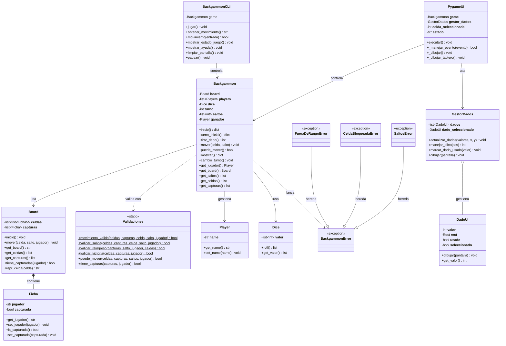

# Justificación del Proyecto Backgammon

**Autor:** Luciano Agustin Fernandez Actis  
**Materia:** Computación 2025

## 1. Resumen del Diseño General

Arquitectura por capas aplicado:

- **Capa de Negocio** (`core/`): Lógica pura del juego (Backgammon, Board, Validaciones, Dice, Ficha, Player)
- **Capa de Presentación** (`cli/`, `pygame_ui/`): Interfaces de usuario que consumen API del core
- **Capa de Testing** (`tests/`): 90% de cobertura con tests unitarios

Esta separación permite que la lógica sea independiente de la UI, facilitando extensibilidad y testing.


## 2. Diseño de Clases y Responsabilidades

### 2.1. Clase `Backgammon` (Orquestador)

**Responsabilidad:** Coordinar el flujo del juego entre todos los componentes.

**Justificación:** Patrón Facade que proporciona interfaz simplificada para que las UIs interactúen con el juego sin conocer detalles internos.

**Atributos:**
```python
__board__ (Board)        # Tablero del juego
__players__ (list)       # [Player("X"), Player("O")]
__dice__ (Dice)          # Generador de dados
__turno__ (int)          # Índice jugador actual (0 o 1)
__saltos__ (list)        # Movimientos disponibles
__ganador__ (Player)     # Ganador o None
```

**Métodos clave:**
- `inicio()`: Inicializa juego y determina turno inicial
- `turno_inicial()`: Lanza dados hasta obtener valores diferentes
- `tirar_dado()`: Genera nuevos valores
- `mover(celda, salto)`: Ejecuta movimiento validado
- `puede_mover()`: Verifica si hay movimientos válidos
- `mostrar()`: Retorna dict con estado completo

---

### 2.2. Clase `Board` (Estructura de Datos)

**Responsabilidad:** Mantener y modificar el estado del tablero (sin validar reglas).

**Justificación:** Enfoque único en estructura, delegando validaciones a `Validaciones` (SRP).

**Atributos:**
```python
__celdas__ (list[list[Ficha]])  # 24 posiciones del tablero
__capturas__ (list[Ficha])      # Fichas en la barra
```

**Métodos clave:**
- `inicio()`: Coloca 15 fichas por jugador en posiciones estándar
- `mover(celda, salto, jugador)`: Ejecuta movimiento físico
- `get_board()`: Genera representación ASCII visual
- `tiene_capturadas(jugador)`: Verifica fichas en barra

---

### 2.3. Clase `Validaciones` (Reglas del Juego)

**Responsabilidad:** Verificar todas las reglas de Backgammon.

**Justificación:** Centraliza validaciones en métodos estáticos sin estado (fácil testing, evita duplicación).

**Métodos principales:**
```python
# Todos @staticmethod
movimiento_valido(celdas, capturas, celda, salto, jugador) -> bool
validar_salida(celdas, capturas, celda, salto, jugador) -> bool
validar_reingreso(capturas, salto, jugador, celdas) -> bool
validar_victoria(celdas, capturas, jugador) -> bool
puede_mover(celdas, capturas, saltos, jugador) -> bool
```

**Decisión:** Métodos estáticos porque son funciones puras sin estado interno.

---

### 2.4. Clase `Ficha` (Entidad)

**Responsabilidad:** Representar una ficha individual.

**Atributos:**
```python
__jugador__ (str)      # "X" o "O"
__capturada__ (bool)   # True si está en barra
```

**Justificación:** Encapsula concepto de ficha con estado rico (permite extensiones futuras).

---

### 2.5. Clase `Player` (Entidad)

**Responsabilidad:** Representar a un jugador.

**Atributos:**
```python
__name__ (str)  # Identificador ("X" o "O")
```

**Justificación:** Aunque simple, permite extensiones futuras (estadísticas, IA) sin romper código.

---

### 2.6. Clase `Dice` (Generador de Aleatoriedad)

**Responsabilidad:** Generar valores aleatorios de dados.

**Atributos:**
```python
__valor__ (list[int])  # Valores actuales
```

**Métodos:**
- `roll()`: Genera 2 valores (o 4 si son dobles)
- `get_valor()`: Retorna últimos valores

**Justificación:** Encapsula lógica de dados dobles y facilita testing con mocks (`FakeDice`).

---

### 2.7. Clase `BackgammonCLI` (Interfaz de Usuario)

**Responsabilidad:** Gestionar interacción por consola.

**Atributos:**
```python
game (Backgammon)  # Instancia del juego
```

**Métodos principales:**
- `jugar()`: Bucle principal
- `obtener_movimiento()`: Captura input
- `movimiento(entrada)`: Procesa comando
- `mostrar_estado_juego()`: Renderiza estado
- `mostrar_ayuda()`: Muestra instrucciones

**Justificación:** Separa UI de lógica. Solo consume API pública de `Backgammon`.

---

### 2.8. Clases Pygame UI

#### `PygameUI`
**Responsabilidad:** Controlador principal de interfaz gráfica.

**Atributos clave:**
```python
__game__ (Backgammon)
__gestor_dados__ (GestorDados)
__celda_seleccionada__ (int|None)
__estado__ (str)  # 'menu', 'jugando', 'victoria'
```

#### `DadoUI`
**Responsabilidad:** Representa un dado clickeable con estado visual.

#### `GestorDados`
**Responsabilidad:** Gestiona múltiples dados y su selección (patrón Manager).

---

## 4. Excepciones y Manejo de Errores

### Jerarquía de Excepciones
### Jerarquía Implementada
```python
BackgammonError (base)
├── FueraDeRangoError          # Celda fuera de 0-23
├── CeldaInvalidaError         # Celda vacía/inválida
├── CeldaBloqueadaError        # Destino bloqueado
├── FichasCapturadasError      # Debe reingresar primero
├── SinFichasCapturadas        # Sin fichas en barra
├── ReingresoInvalidoError     # Reingreso inválido
├── SalidaInvalidaError        # No puede sacar fichas
└── SaltosError                # Errores con dados
```

**Justificación**: 
- **Clase base común**: Permite capturar todas las excepciones del dominio con `except BackgammonError`
- **Excepciones específicas**: Facilitan el manejo granular de errores en la UI
- **Semántica clara**: Cada excepción describe exactamente qué regla se violó

**Uso en CLI**: La CLI captura `BackgammonError` para errores esperados del juego y `Exception` genérica para errores inesperados, mostrando mensajes apropiados al usuario.

## 5. Estrategia de Testing y Cobertura


### Cobertura: 90% (Requisito cumplido)

| Módulo              | Cobertura |
|---------------------|-----------|
| dice.py             | 100%      |
| exceptions.py       | 100%      |
| ficha.py            | 100%      |
| player.py           | 100%      |
| board.py            | 88%       |
| backgammon.py       | 85%       |
| validaciones.py     | 80%       |

### Enfoque de Testing

- **Tests unitarios por módulo**: Cada clase tiene su suite de tests
- **Uso de mocks**: Para aislar componentes (ej: `FakeDice` en tests de `Backgammon`)

### Tests

### 1. **`test_board.py`**
Tests del tablero y operaciones básicas:
- Movimientos normales, capturas y reingresos desde la barra
- Salidas de tablero (permitidas/bloqueadas según reglas)
- Representación visual correcta del tablero en formato texto
- Validación de estructura y formato de celdas
- Manejo de fichas propias vs enemigas en destinos

**Casos clave:**
- `test_get_board_inicio`: Verifica configuración inicial estándar
- `test_mover_destino_capturar_enemigo`: Captura de ficha enemiga solitaria
- `test_reingreso_ficha`: Reingreso correcto desde la barra

---

### 2. **`test_validaciones.py`**
Tests de reglas del juego de Backgammon:
- Validación completa de movimientos según dirección del jugador
- Reglas de salida del tablero (todas las fichas en casa)
- Detección de victoria (sin fichas en tablero ni capturas)
- Sistema `puede_mover()` para verificar movimientos disponibles
- Validación de capturas y reingresos

**Casos clave:**
- `test_movimiento_valido_X_ok` / `test_movimiento_valido_O_ok`: Movimientos básicos por jugador
- `test_validar_salida_raises_si_fichas_fuera_home`: No se puede sacar con fichas fuera de casa
- `test_puede_mover_false_capturas_sin_reingreso`: Bloqueo cuando hay capturas sin posibilidad de reingreso

---

### 3. **`test_backgammon.py`**
Tests de orquestación y flujo del juego:
- Selección aleatoria del turno inicial (dados diferentes)
- Integración correcta entre Board, Validaciones y Dice
- Consumo apropiado de dados tras cada movimiento
- Prevención de movimientos sin lanzar dados (`SaltosError`)

**Casos clave:**
- `test_turno_inicial_elige_correctamente`: Verifica selección de jugador inicial
- `test_mover_sin_tirar_dados_lanza_saltos_error`: Error si intenta mover sin tirar dados

---

### 4. **`test_dice.py`**
Tests de generación de dados:
- Validación de valores aleatorios en rango 1-6
- Manejo correcto de dados dobles (4 valores iguales)
- Verificación de tipos de datos retornados
- Representación textual de dados (`__str__`)

**Casos clave:**
- `test_roll_resultados_validos`: Todos los valores entre 1-6
- `test_roll_dobles`: Cuando salen dobles se devuelven 4 valores iguales

---

### 5. **`test_ficha.py`**
Tests de entidad Ficha:
- Creación correcta con jugador propietario
- Getters y setters de propiedades (jugador, estado capturada)
- Representación textual para debugging (`__repr__`)
- Manejo de estados: libre vs capturada

**Casos clave:**
- `test_crear_ficha`: Inicialización con jugador y estado libre
- `test_set_capturada`: Cambio de estado entre libre/capturada

---

### 6. **`test_player.py`**
Tests de entidad Jugador:
- Inicialización con identificador ('X' o 'O')
- Modificación de identificador mediante setter
- Getter de nombre del jugador

**Casos clave:**
- `test_player_init_y_get`: Creación y obtención de nombre
- `test_player_set_name`: Modificación de identificador

---

### 7. **`test_cli.py`**
Tests exhaustivos de interfaz de línea de comandos:

#### **Inicialización y UI básica**
- Creación del juego, limpieza de pantalla, título, pausas
- `test_init_crea_juego`: Verifica instancia de Backgammon
- `test_limpiar_pantalla`: Llamada correcta a `os.system`
- `test_mostrar_titulo`: Renderizado del título con bordes

#### **Entrada de usuario**
- Movimientos válidos, comandos (salir/ayuda), manejo de interrupciones
- `test_obtener_movimiento_valido`: Input formato "12 3"
- `test_obtener_movimiento_salir`: Comando "salir"
- `test_obtener_movimiento_interrupt`: Ctrl+C capturado

#### **Estado del juego**
- Visualización de turno, dados, fichas capturadas
- `test_mostrar_estado_juego_basico`: Display de turno y dados
- `test_mostrar_estado_con_capturas`: Aviso de fichas capturadas
- `test_mostrar_estado_indica_reingreso`: Mensaje para reingresar

#### **Procesamiento de movimientos**
- Ejecución válida/inválida, manejo de errores específicos
- `test_procesar_movimiento_exitoso`: Movimiento válido completa turno
- `test_procesar_movimiento_invalido`: Error de dominio continúa turno
- `test_procesar_movimiento_valor_error`: Manejo de entrada no numérica

#### **Comandos especiales**
- Ayuda completa, salir con confirmación
- `test_mostrar_ayuda`: Renderizado de ayuda con secciones
- `test_movimiento_comando_salir_confirmado`: Salida con 's'
- `test_movimiento_comando_salir_cancelado`: Cancelación con 'n'

#### **Validaciones de formato**
- Entrada con espacios extra, conversión a minúsculas
- `test_movimiento_entrada_espacios_extra`: Trimming de input
- `test_obtener_movimiento_convierte_minusculas`: Normalización

---


## 6. Aplicación de Principios SOLID

### S - Single Responsibility Principle 
Cada clase tiene una única razón para cambiar:
- `Board`: Solo cambia si cambia la estructura del tablero
- `Validaciones`: Solo cambia si cambian las reglas
- `Backgammon`: Solo cambia si cambia el flujo del juego
- `CLI`/`PygameUI`: Solo cambian si cambia la interfaz de usuario

### O - Open/Closed Principle 
- Las clases están abiertas a extensión (herencia, composición) pero cerradas a modificación
- Ejemplo: Agregar una nueva UI no requiere modificar `Backgammon`
- `Validaciones` puede extenderse con nuevas reglas sin modificar las existentes

### L - Liskov Substitution Principle 
- No hay jerarquías de herencia complejas (diseño simple)
- Las excepciones heredan correctamente de `BackgammonError`

### I - Interface Segregation Principle 
- `Backgammon` expone solo métodos necesarios para las UIs (`mover()`, `mostrar()`, `tirar_dado()`)
- Las UIs no dependen de métodos que no usan

### D - Dependency Inversion Principle 
- `Backgammon` acepta instancias de `Board`, `Dice`, `Player` en su constructor (inyección de dependencias)
- Facilita testing con mocks (ej: `FakeDice`)
- Las UIs dependen de la abstracción `Backgammon`, no de detalles internos

## 7 Reglas de backgammon cumplidas

| Regla | Implementación | Test |
|-------|---------------|------|
| **Movimiento básico** | `Validaciones.movimiento_valido()` | ✓ |
| **Capturas** | `Board.mover()` detecta 1 ficha enemiga | ✓ |
| **Bloqueo** | `_validar_destino()` verifica 2+ enemigas | ✓ |
| **Reingreso obligatorio** | `tiene_capturas()` en validación | ✓ |
| **Reingreso desde barra** | `validar_reingreso()` + `mover(-1, salto)` | ✓ |
| **Salida del tablero** | `validar_salida()` verifica condiciones | ✓ |
| **Salida con dado mayor** | Verifica fichas más atrás | ✓ |
| **Dados dobles** | `Dice.roll()` retorna 4 valores | ✓ |
| **Victoria** | `validar_victoria()` cuenta fichas totales | ✓ |

---

## 8. Diagrama de Clases (UML)



---

## 9 Flujo de un Movimiento

```
Usuario: "12 5"
    ↓
CLI.movimiento("12 5")
    ↓
Backgammon.mover(12, 5)
    ↓
[1] Verifica saltos disponibles
    if not __saltos__: raise SaltosError
    ↓
[2] Valida con Validaciones
    movimiento_valido(celdas, capturas, 12, 5, "X")
    ├─ Verifica capturas
    ├─ Valida origen (rango, ficha propia)
    ├─ Calcula destino = 12 + 5 = 17
    ├─ Valida destino (no bloqueado)
    └─ return True
    ↓
[3] Ejecuta movimiento
    Board.mover(12, 5, "X")
    ├─ Saca ficha de celdas[12]
    ├─ Captura si hay 1 enemiga en destino
    └─ Coloca en celdas[17]
    ↓
[4] Consume salto
    __saltos__.remove(5)
    ↓
[5] Verifica victoria
    if validar_victoria(): __ganador__ = jugador
    ↓
[6] Cambia turno si no quedan saltos
    if not __saltos__: cambio_turno()
```

---

## 10. Cumplimiento de Requisitos

### ✓ Nomenclatura de Atributos
Todos los atributos usan `__nombre__`:
```python
self.__board__
self.__jugador__
self.__valor__
```

### ✓ Docstrings Completos
Todas las funciones documentadas con:
- Descripción
- Args
- Returns
- Raises (si aplica)

### ✓ Cobertura > 90%
Coverage report: **90%** total

### ✓ CHANGELOG.md
Siguiendo https://keepachangelog.com con entradas desde v0.0.1 hasta v0.5.0

### ✓ README.md
Instrucciones completas de instalación y ejecución

### ✓ Docker
Dockerfile y docker-compose.yml funcionales para:
- `backgammon-game`: Modo CLI
- `backgammon-test`: Ejecución de tests

### ✓ CI/CD
GitHub Actions con:
- Tests automáticos
- Cobertura
- Pylint
- Auto-generación de REPORTS.md

### ✓ Protección de Rama
Main protegida, requiere PRs

---